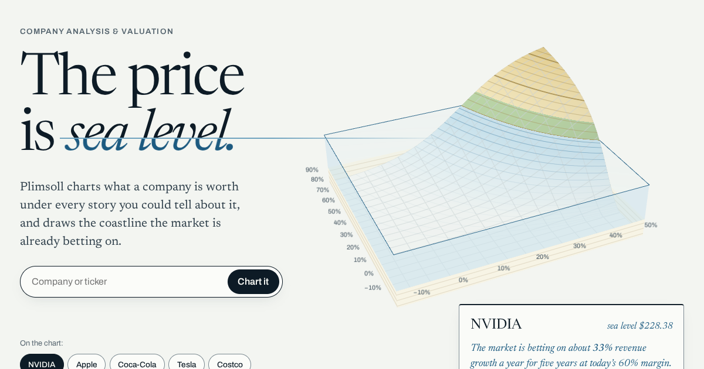

# Plimsoll

**The price is sea level.** Plimsoll is a company analysis and valuation instrument that draws value as a nautical chart. Every story you could tell about a company, from revenue growth across to operating margin up, is a point on a landscape whose height is what that story is worth per share. Flood it to today's share price. Dry land is worth more than the price, water is worth less, and the coastline is the story the market is already betting on.



- **The market's story, drawn.** A reverse DCF solves the growth and margin today's price implies and draws them as a coastline.
- **Your story, on the same chart.** Drag your bearing, pick one of six narratives, or set every input. Read your value, your freeboard (margin of safety) and your odds on dry land from 4,000 Monte Carlo revaluations.
- **Any company.** Thirteen companies surveyed from SEC filings, any SEC filer live through `/api/company`, or a private company from seven figures.
- **Shareable.** A link reproduces a chart exactly; a chart image exports at 1,200 × 1,500.

## Quick start

Requires Node 22.12 or later.

```sh
npm ci
npm run dev            # http://localhost:5173
```

Production build and preview, as deployed:

```sh
npm run build          # typecheck, client build, SSR build, prerender 17 routes
npx vite preview       # http://localhost:4173, with production headers and rewrites
```

## Scripts

| Script | What it does |
|---|---|
| `dev` | Vite dev server |
| `build` | Typecheck, then client build, server build and prerender (`scripts/prerender.mjs`) into `dist/` |
| `build:fast` | The same without the typecheck |
| `build:artifact` | One self-contained HTML file with hash routing, for hosts without rewrites (`dist-artifact/`) |
| `check` | `typecheck`, `lint` and `test` |
| `test` | Vitest: engine, SEC normaliser, contours, both API functions, the CSP |
| `test:e2e` | Playwright on desktop and Pixel 7, including axe-core accessibility scans |
| `test:visual` / `test:visual:update` | Visual regression against baselines (run in the pinned Playwright container) |
| `budget` | Asset budgets for the production build |
| `lighthouse` | Lighthouse CI with the budgets in `lighthouserc.json` |
| `data:refresh` | Re-survey the companies from SEC EDGAR into a reviewable diff (`scripts/refresh-data.ts`) |
| `fonts` | Rebuild the subset fonts (`scripts/fonts.py`, needs `fonttools` and `brotli`) |

## Environment

| Variable | Where | Purpose |
|---|---|---|
| `SEC_USER_AGENT` | Server | Required by `/api/company` under the SEC's fair-access policy, e.g. `Plimsoll ops@example.com` |
| `ALPHAVANTAGE_API_KEY` | Server | Optional. Latest close for live surveys; without it the visitor sets the price |
| `TELEMETRY_FORWARD_URL`, `TELEMETRY_FORWARD_TOKEN` | Server | Optional. Forward telemetry as NDJSON with a bearer token; otherwise it goes to the function log |
| `VITE_LIVE_API` | Build | `1` to offer live SEC surveys in search |
| `VITE_TELEMETRY_URL` | Build | Where field telemetry goes, usually `/api/telemetry`. Unset means no telemetry code ships |
| `VITE_TELEMETRY_SAMPLE` | Build | Share of page views that report, 0 to 1 (default 1) |
| `VITE_ROUTER` | Build | `hash` for static hosts without rewrites |
| `VITE_SHARE_BASE` | Build | Hash builds only: the public URL that shared links open, such as a published preview's address |
| `SITE_URL` | Build | Origin for canonical URLs, Open Graph, sitemap and `llms.txt` (default `https://plimsoll.app`) |

## Deploy

**Vercel** (configured in `vercel.json`):

1. Import the repository. Build command and output directory are pinned (`npm run build`, `dist`), and `api/` deploys as two functions.
2. Set the environment variables above for Production and Preview.
3. Every pull request gets a preview deployment; `main` deploys to production.
4. To roll back, run `vercel rollback` or use Instant Rollback in the dashboard. Telemetry tags each batch with the build's commit, so the switch is visible in the data.

`vercel.json` also carries the rewrites (any non-file path without a prerendered page gets the app shell, `app.html`) and the security headers, including a Content-Security-Policy that allows inline script only by hash. `vite preview` applies the same headers, so tests run under the real policy.

**Elsewhere:** any static host works if it serves `dist/` with clean URLs and falls back to `/app.html`. Without rewrites, build with `VITE_ROUTER=hash` or use `npm run build:artifact`.

## Project layout

```
api/                 Serverless functions: company (live SEC survey), telemetry (collector)
docs/                Strategy, creative direction, architecture, storyboard, design system, award audit, launch checklist
e2e/                 Playwright journeys, accessibility scans, visual regression
public/              Favicon, touch icon, social image, manifest
scripts/             Prerender, budgets, fonts, data refresh, single-file packaging, social images
src/
  app/               App shell and routes
  chart/             Flat chart (Canvas 2D), relief (Three.js, GLSL), contours, poster
  data/              Company snapshots with sources, market inputs, SEC normaliser
  engine/            Valuation: FCFF DCF, reverse DCF, value grid, Monte Carlo (pure TypeScript)
  lib/               Router, theme, device capability, telemetry, storage
  model/             Survey, narratives, scenarios, share tokens, analysis hook, copy
  pages/             Home, chart, atlas, method, survey, 404
  styles/            Tokens, fonts, base
  ui/                Header, command palette, instrument, gauges, tables, cards
```

## Quality

Every pull request runs `.github/workflows/ci.yml`:

- types, lint and unit tests
- the production build and asset budgets
- end-to-end and accessibility tests on two devices
- Lighthouse on five routes, mobile
- visual regression

Current results are in [docs/ARCHITECTURE.md](docs/ARCHITECTURE.md#performance-budget-production-build) and [docs/AWARD_AUDIT.md](docs/AWARD_AUDIT.md).

## Documents

| Document | Contents |
|---|---|
| [Strategy](docs/STRATEGY.md) | Competitors, unmet jobs, non-customers, strategy canvas, ERRC grid, positioning, business model |
| [Creative direction](docs/CREATIVE_DIRECTION.md) | The idea, three directions, clichés broken, type, colour, motion and interaction principles |
| [Architecture](docs/ARCHITECTURE.md) | Sitemap, journeys, content model, stack, rendering, observability, quality gates, budgets |
| [Storyboard](docs/STORYBOARD.md) | Section-by-section layout and motion choreography, the signature moment |
| [Design system](docs/DESIGN_SYSTEM.md) | Tokens, measured contrast, components and states, responsive and data-visualisation rules |
| [Award audit](docs/AWARD_AUDIT.md) | Jury and developer scorecards, prioritised fixes, award submission |
| [Launch checklist](docs/LAUNCH_CHECKLIST.md) | Performance, accessibility, SEO, devices, analytics, security, data, release |

## Notes

Plimsoll shows what assumptions imply. It is not investment advice. Company figures come from SEC filings (public domain); sources and notes are listed on every chart. Newsreader and Archivo are used under the SIL Open Font License (`src/assets/fonts/`).
