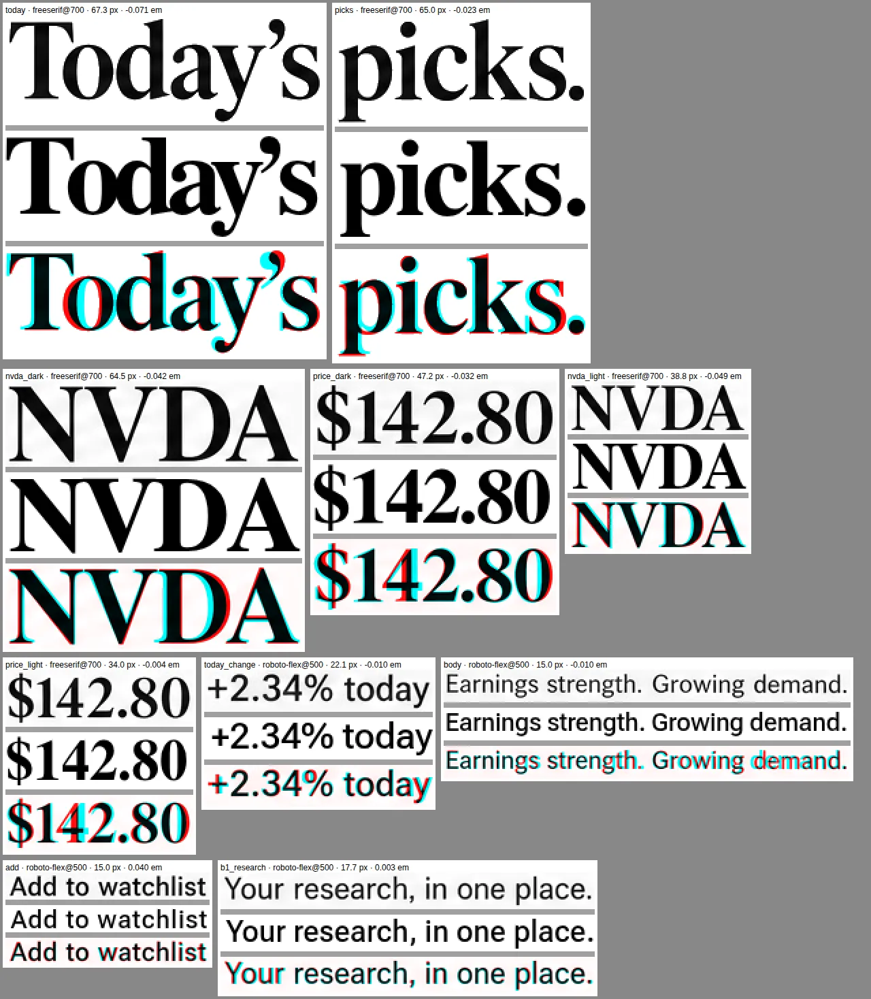
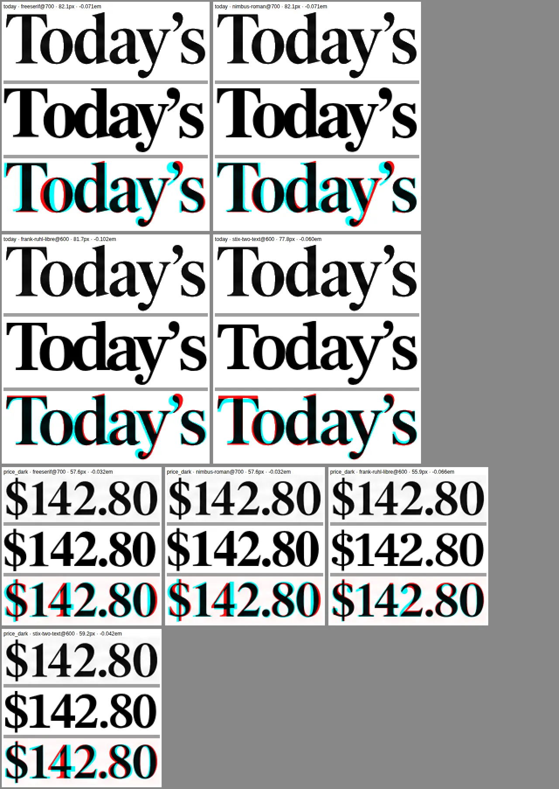
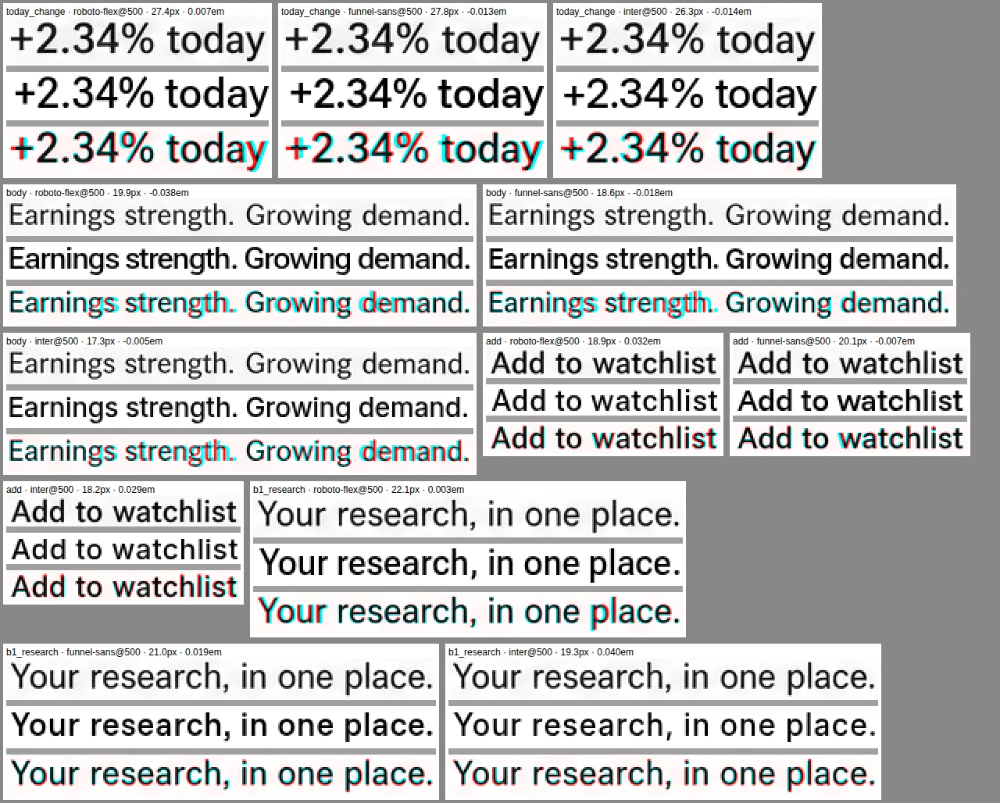

# Typography

Version 3 of the specification locks typography to the reference photographs: the display type
keeps their letterforms, serif details, stroke contrast, weight, proportions and numeral shapes;
the compact interface type keeps its weights, spacing and numeric appearance. Exact family names
are not given, earlier substitute choices (Bodoni Moda and Inter) are withdrawn, and where a
reference-derived size differs visually from a photograph, the photograph governs.

This page records what was matched, how it was verified, which assets ship, and what still
differs.

## Result

| Role      | Asset                                                | Design             | Licence                                  |
| --------- | ---------------------------------------------------- | ------------------ | ---------------------------------------- |
| Display   | **FreeSerif Bold** (GNU FreeFont, version 0412.4271) | Times Roman design | GPL-3.0-or-later with the font exception |
| Interface | **Roboto Flex** (version 3.200), weight axis 400–700 | Roboto design      | SIL Open Font License 1.1                |

Display covers headlines, tickers, prices and every other serif figure in the photographs (all of
them are bold). Interface covers labels, controls, copy and data. Both are self-hosted as subset
WOFF2 files; the tokens live in `src/styles/tokens.css`.



_Each cell: photograph crop, the bundled face at the fitted size and tracking, and the overlay
(shared ink black, photograph only red, render only cyan). Sizes are CSS px._

## How the faces were identified

**Samples.** 112 crops from the 13 photographs in the specification: 51 display samples
(including the named "Today's", "picks.", "NVDA" and "$142.80" on both surfaces) and 61 interface
samples (labels, body copy, buttons, tabs, figures, eyebrows). Each crop is normalised against
its local background (dark ink on paper, light ink on charcoal); the overlapping two-line headline
is separated by connected components.

**Rendering.** Each candidate is rendered by Chromium (HarfBuzz shaping, the font's own kerning)
at the size whose ink height matches the crop, searched ±14 %, with uniform tracking fitted to the
ink width. 476 image px of phone screen correspond to 390 CSS px.

**Scores.**

- _rigid_: soft Dice overlap of the whole fitted line;
- _elastic_: the same when each glyph may shift by up to 7 % of the size. The photographs are
  generated images with irregular spacing, so this judges letterforms apart from spacing;
- _mass_: rendered ink ÷ photographed ink at the height-derived size, a weight estimate that does
  not depend on image softness;
- fitted tracking and natural width, which show whether a face has the photographed proportions
  without being stretched by tracking.

**Candidates.** 37 serif families (85 family/weight pairs) and 39 sans families (115 pairs), all
with licences that allow web embedding. A similar-looking face is not evidence: the ranking below
is what decided.

Display, 41 samples (the first verification set):

| Candidate             | Elastic | Rigid  | Fitted tracking | Natural width |
| --------------------- | ------- | ------ | --------------- | ------------- |
| **FreeSerif 700**     | 0.8320  | 0.7770 | −0.034 em       | 1.069         |
| Nimbus Roman 700      | 0.8286  | 0.7788 | −0.037 em       | 1.078         |
| Source Serif 4 700    | 0.8275  | 0.7858 | −0.046 em       | 1.097         |
| Frank Ruhl Libre 600  | 0.8254  | 0.7767 | −0.060 em       | 1.123         |
| STIX Two Text 600     | 0.8211  | 0.7710 | −0.052 em       | 1.107         |
| Libre Caslon Text 700 | 0.8200  | 0.7822 | −0.056 em       | 1.102         |
| PT Serif 700          | 0.8181  | 0.7743 | −0.060 em       | 1.117         |
| Liberation Serif 700  | 0.8128  | 0.7620 | −0.042 em       | 1.087         |
| Bodoni Moda 700       | 0.7628  | 0.7019 | −0.076 em       | 1.151         |

FreeSerif and Nimbus Roman are both Times Roman designs and stay first and second on a held-out
board (0.8384 and 0.8380). On the six named samples FreeSerif also leads (mean 0.8474; Nimbus
Roman 0.8451, Frank Ruhl Libre 0.8442, Source Serif 4 0.8377, STIX Two Text 0.8322), though not on
every one: Source Serif 4 fits "Today's" and "picks." slightly better and STIX Two Text the
charcoal "$142.80", while both fall well behind on "NVDA". No other face is better across the
set. Bodoni Moda, the withdrawn substitute, ranks last: its hairlines and vertical stress are not
what the photographs show.

Interface, 28 samples at 15 px and above (small text is too soft to separate faces):

| Candidate           | Elastic | Rigid  | Fitted tracking | Natural width |
| ------------------- | ------- | ------ | --------------- | ------------- |
| **Roboto Flex 500** | 0.7296  | 0.6856 | −0.003 em       | 1.006         |
| Funnel Sans 500     | 0.7269  | 0.6873 | −0.020 em       | 1.041         |
| IBM Plex Sans 500   | 0.7267  | 0.6842 | −0.018 em       | 1.034         |
| Hanken Grotesk 500  | 0.7266  | 0.6765 | −0.023 em       | 1.047         |
| Roboto 500          | 0.7265  | 0.6924 | +0.003 em       | 0.993         |
| Inter 500           | 0.7213  | 0.6854 | −0.003 em       | 1.006         |

Roboto Flex fits without tracking at its natural width and scores highest. Funnel Sans, IBM
Plex Sans and Hanken Grotesk need 2–4 % compression to fit, which shows in the overlays as
drifting letter positions; Inter fits the width, but its letterforms score lower. Over all 51
interface samples, Roboto and Roboto Flex are first and third (0.7243 and 0.7220, Funnel Sans
0.7227). Roboto Flex ships because its weight axis provides the intermediate weights the
photographs measure.





## Verified assets

| File (`public/fonts/`)                | Source                                                              | Size     |
| ------------------------------------- | ------------------------------------------------------------------- | -------- |
| `freeserif-700-latin.woff2`           | `FreeSerifBold.ttf`, Debian `fonts-freefont-ttf` 20211204+svn4273-2 | 27.0 KiB |
| `freeserif-700-latin-ext.woff2`       | same                                                                | 66.0 KiB |
| `roboto-flex-400-700-latin.woff2`     | `@fontsource-variable/roboto-flex` 5.3.0 (Google Fonts build)       | 23.2 KiB |
| `roboto-flex-400-700-latin-ext.woff2` | same                                                                | 14.9 KiB |
| `FreeSerif-LICENSE.txt`               | font exception and the full GPL version 3                           |          |
| `RobotoFlex-OFL.txt`                  | SIL Open Font License 1.1                                           |          |

Source checksums (SHA-256): `FreeSerifBold.ttf`
`f078f2ac5d38addc71e2c123d86584341360b5bf27bc1cf238574ebe4f5a0f4d`;
`roboto-flex-latin-wght-normal.woff2`
`8aabd65a22003f488ba7d2da8a8155a7f90e195ab2a11cd006615d00a0ee5eff`;
`roboto-flex-latin-ext-wght-normal.woff2`
`860475bc6d859474547084d6b7ab158d2c6a107b024abe7d9831faf968e9ec83`.

`scripts/build-fonts.py` produces the files reproducibly (the same bytes on every run). FreeSerif
is only subset, with its glyphs, hinting and names unaltered, so pages that embed it stay outside
the GPL under the font exception while the font files themselves remain GPL. Roboto Flex is
instanced to its weight axis (other axes at their defaults). Each family is split into a preloaded
latin file and a latin-ext file fetched only for pages that use those characters. The in-app
Licences page names both.

## Size, weight and tracking

Sizes were measured from the ink height of each crop against the glyph extents of the same text
in the matched face, in CSS px at 390 px; underlined text (text actions, links) is measured by its
ink width instead, because the underline inflates the height. The photographs are generated and
not always consistent with each other (tabs measure 13.8–19.7 px on different screens), so each
role takes the median, as the specification's visual completion gate asks ("shared rules resolve
incidental image inconsistencies"), and only a screen whose every sample differs from the median
by 10 % or more gets its own value.

| Role                               | Measured                            | Set                                             |
| ---------------------------------- | ----------------------------------- | ----------------------------------------------- |
| Screen headline                    | 59–72, median 64; leading 0.80–0.84 | 64, line height 0.82, −0.045 em; line fit below |
| Detail ticker (S02, S08, S10, S16) | 64.5–64.8                           | 64, the headline tier                           |
| Model value, offer range, reaction | 50–58                               | 54 (S15, S16), 50 (S08, S10)                    |
| Quote, threshold entry             | 44–47                               | 46                                              |
| Feature figures, plan name         | ≈34 (S08), 39.5–42.9 (S24), 40.4    | 37.4 shared (S08, S24), 40 (S21)                |
| Feature section                    | 29–33                               | 31                                              |
| Pick ticker / pick price (S01)     | 38.8 / 34.0                         | 38 / 34                                         |
| Section heading                    | 23–28                               | 25                                              |
| List ticker                        | 26–30                               | 28 (30 on S07)                                  |
| Row price                          | 23.5–24.5                           | 24, untracked (a numeric column)                |
| Row title, small section           | 18–23                               | 21–22                                           |
| Stat figure                        | 17–22                               | 18 (S02 ratings), 22                            |
| Lede                               | 17.7–18.7                           | 18                                              |
| Primary button                     | 16.6–18.9                           | 17                                              |
| Entered value                      | 16–17                               | 16 (also keeps iOS from zooming on focus)       |
| Tabs                               | 13.8–19.7, median 16.6              | 16; 14 on S01; 18 on S19 and S23                |
| Chart range control (S02)          | 11.4                                | 13, the control floor                           |
| Row change                         | 15–17                               | 16; 14 in the S01 radar rows                    |
| Body, rows, other buttons          | 14.3–16.2                           | 15, summaries 16, buttons 15.5                  |
| Text actions (by width)            | 12.6–14.8                           | 14                                              |
| Form label                         | 13.9–15.5                           | 14                                              |
| Form hint, step counter, legal     | 11.9–13.2                           | 13, the label floor                             |
| Meta, names, chips                 | 12.5–14                             | 13–14, chips 12                                 |
| Footnote                           | 11.1–13.5                           | 12                                              |
| Eyebrow                            | 10–11.5, +0.13–0.24 em              | 11, +0.2 em                                     |
| Stat and table labels              | 10–12, +0.00–0.06 em                | 11, +0.04 em (sentence case on S02)             |
| Top-bar title                      | 11.5–12.5, +0.11–0.24 em            | 12, +0.12 em                                    |
| Tab bar, chart axes, day names     | 10–11                               | 11, the micro floor                             |

Weights come from ink mass at the measured size: body copy ≈ 410 → 400, rows and controls
≈ 440–450 → 450, change figures ≈ 570 → 550, eyebrows ≈ 610 → 600. Every serif in the
photographs is bold: lighter-looking serif lines (the IPO sector line, earnings estimates) carry
0.76–0.83 of FreeSerif Bold's ink, the same as titles that are plainly bold ("Demand", 0.81),
because thin strokes never reach full ink in a soft image.

**Floors.** The specification also says to keep important labels at 13 px or above and that 11 px
microcopy cannot carry the only required instruction. Text a person reads in order to act stays at
13 px or more even where its photograph is smaller: form hints (they state rules such as "8–128
characters"), step counters, legal links, notes that say why an action is unavailable ("Reconnect
to …"), password progress and errors, the journal's save state, filter group labels and the chart
range control. Photographed microcopy (eyebrows, stat captions, table heads, the tab bar, axis
labels, day names) is set at 11 px, and nothing is smaller.

**Tracking.** Numeric data columns are not tracked, as the specification asks: the earnings
results table, the archive's return column, key-value values and row prices. Single figures
(quotes, model values, stat strips) keep the photographed −0.02 em.

**Audit.** Every photographed text element that the app also renders was matched by its text and
its computed size compared with the measurement: 201 elements on 24 screens, median deviation
3.4 %, 184 within 10 %. Each of the other 17 has a known cause: the matcher picked a different
element or the crop was poor (5), an underline inflated the height (2, sized by width instead), the
serif button above (1), a shared size where the photographs disagree (7, for example "Notify me
about" at 18.3 px beside "Quiet hours" at 20.8 px on the same screen) or one of the floors (2).

**Line breaks.** Headlines keep the photographed breaks: a title is set at 64 px unless a word
would not fit its column (then at the size where it fits) or unless coming down, to no less than
80 %, brings it within its photographed line count. "Today's / picks." stays at 64 px, "The
investment case." comes down to two lines, "Inside the / semiconductor / cycle." keeps three lines
at the size where "semiconductor" fits, and "Stay informed." takes one line
(`src/components/Header.tsx`).

## Loading

The two latin files are preloaded and use `font-display: swap`. While they load, metric-matched
local fallbacks (Times New Roman, Liberation Serif or Tinos; Arial, Liberation Sans or Arimo) hold
the same space through `size-adjust` and ascent, descent and line-gap overrides, so the swap does
not move the page (CLS 0–0.04 in Lighthouse). The fallbacks are placeholders during loading, not
the design; the latin files are about 50 KiB together.

## Evidence

Photograph (left of each pair) next to the app at 390 px, for every photographed screen:

| Board                                    | Screens                            |
| ---------------------------------------- | ---------------------------------- |
| [S01–S02](typography/board-s01-s02.webp) | Daily picks, Pick analysis         |
| [S03–S04](typography/board-s03-s04.webp) | Sign-in, Personalization           |
| [S05–S06](typography/board-s05-s06.webp) | Market overview, Search            |
| [S07–S08](typography/board-s07-s08.webp) | Earnings calendar, Earnings review |
| [S09–S10](typography/board-s09-s10.webp) | IPO pipeline, IPO dossier          |
| [S11–S12](typography/board-s11-s12.webp) | Investment thesis, Valuation       |
| [S13–S14](typography/board-s13-s14.webp) | Watchlists, Create alert           |
| [S15–S16](typography/board-s15-s16.webp) | Paper portfolio, Paper position    |
| [S17–S18](typography/board-s17-s18.webp) | Research, Report reader            |
| [S19–S20](typography/board-s19-s20.webp) | Alert inbox, Alert settings        |
| [S21–S22](typography/board-s21-s22.webp) | Profile, App settings              |
| [S23–S24](typography/board-s23-s24.webp) | Pick archive, Performance review   |

## Reproduce

```bash
pdfimages -all Stock_Picks_Complete_App_Design.pdf /tmp/spec/img   # poppler-utils
CHROMIUM_PATH=/path/to/chromium npm run typography:verify -- --images /tmp/spec
```

`scripts/typography/verify.mjs` scores the bundled files on the 112 samples in
`scripts/typography/samples.json` and writes `typography-report/report.json` and
`overlays.png`. Add `--candidate "id|path/to/font|weight|display"` to score another face the same
way. The run on 3 October 2026:

| Face            | Samples | Elastic | Rigid  | Mass | Fitted tracking |
| --------------- | ------- | ------- | ------ | ---- | --------------- |
| FreeSerif 700   | 51      | 0.8335  | 0.7808 | 1.09 | −0.035 em       |
| Roboto Flex 500 | 61      | 0.7231  | 0.6894 | 1.00 | +0.022 em       |
| Roboto Flex 450 | 61      | 0.7154  | 0.6837 | 0.93 | +0.024 em       |
| Roboto Flex 400 | 61      | 0.7056  | 0.6762 | 0.86 | +0.025 em       |

Named samples, FreeSerif Bold: "Today's" 67.3 px (−0.071 em), "picks." 65.0 px, "NVDA" 64.5 px
on charcoal and 38.8 px on paper, "$142.80" 47.2 px and 34.0 px.

To rebuild the font files: `pip install fonttools brotli`, then `npm run fonts` (FreeSerif from
`/usr/share/fonts/truetype/freefont/` by default, or `-- --freeserif <path>`).

## What still differs

- **The family names are not proven.** The photographs are generated images. What is verified is
  that these faces reproduce the photographed letterforms, numerals, weights and proportions
  better than every other licensed candidate tested; per-glyph spacing in the photographs remains
  irregular and is not reproduced.
- **One serif button.** The S20 photograph sets "Save preferences" in the serif; every other
  button across the photographs is sans, so it stays sans.
- **Separators.** Several photographed meta lines separate items with "•"; the app uses "·"
  throughout.
- **Content.** Where a screen shows more or different copy than its photograph (extra metadata,
  detail lines), the type matches the photographed role; the content is the product's.
- **Licence choice.** FreeSerif is GPL with the font exception, which permits embedding in web
  pages. If a licence review prefers OFL, Source Serif 4 700 ranked third (0.8275) and is the
  closest OFL face; swapping it in means changing the source file in `scripts/build-fonts.py` and
  the family in `src/styles/fonts.css` and `--font-display`.
